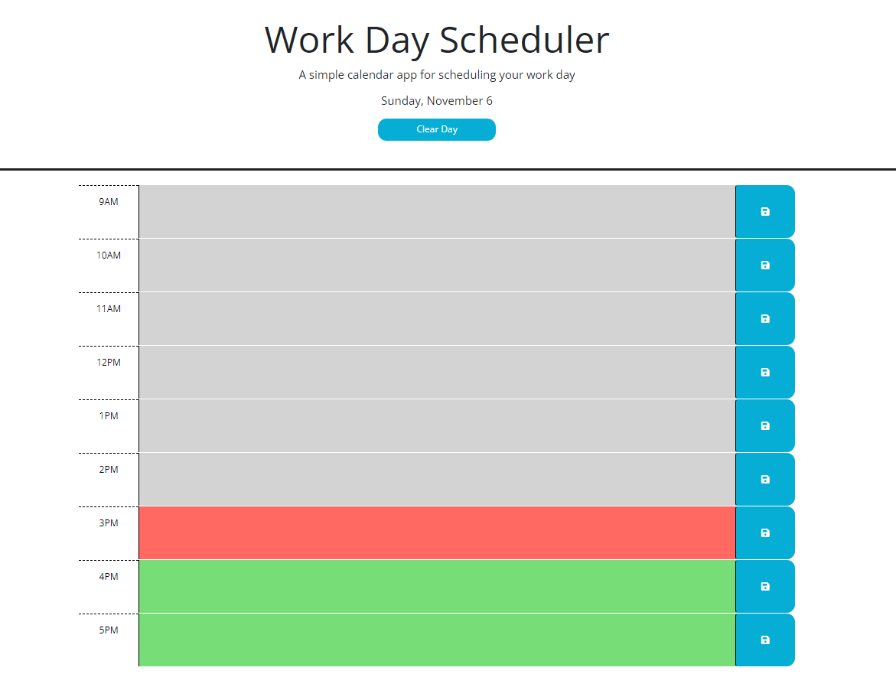

# Work Day Scheduler

## Description

This project created a scheduling app for a standard 9am - 5pm work day. Using starting HTML and CSS, I created a Javascript file that visualizes the passage of time by applying provided CSS classes to the time block elements. The JS also allows the user to input and save text to the time blocks that is saved to their browser's local storage. Additionally, I created a button in the header that allows the user to clear their day should they choose.  The link to the deployed site is below:

https://jennnmarshall.hithub.io/work-day-scheduler

## Installation

N/A

## Usage

This work day scheduler is designed to allow a user to input and save data that will allow them to organize their work day. Select a working hour, input your notes or text, then hit the save button. Your data will be saved to your browser's local storage until you clear it using the button or delete the text in the time block.

## Credits

Starter code provided by bootcampspot.

## License

Please refer to the license in the repo.
